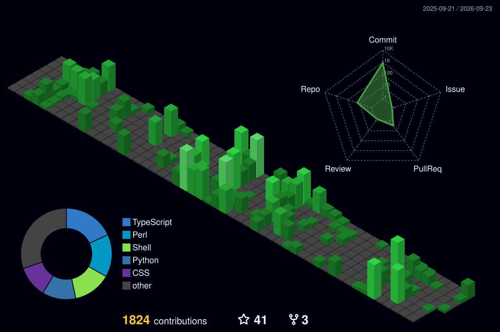

  

  

 

  

 

<!-- SOCIAL && REPO BADGES -->

  
  
  
    
  
  
  
    
  
  &nbsp;
  

---

<!-- TERMINAL-STYLE ABOUT & LICENSE -->
<h2 align="center">🖥️ About Me</h2>

  

 

---

<!-- TECH STACK SECTION -->
<h2 align="center">💻 Tech Stack & Tools</h2>

  
<b>Core Languages</b>

  
    
  <!-- Fallbacks for languages not natively supported by skillicons -->
  
  
    
  
<b>Backend, DevOps & Cloud</b>

  
    
  
<b>Tools & Environment</b>

  

---

<!-- LIVE METRICS DASHBOARD -->
<h2 align="center">📊 GitHub Dashboard</h2>

  <table width="100%" border="0" cellspacing="0" cellpadding="0">
    <tr>
      <td width="50%" align="center" valign="top">
        
      </td>
      <td width="50%" align="center" valign="top">
        
      </td>
    </tr>
    <tr>
      <td width="50%" align="center" valign="top">
        
      </td>
      <td width="50%" align="center" valign="top">
        
      </td>
    </tr>
  </table>

 

  

 

<!-- SPACE SHOOTER CONTRIBUTION GAME -->
<h2 align="center">🚀 Space Shooter Contributions</h2>

  

 

<!-- 3D CONTRIBUTION GRAPH -->
<h2 align="center">📈 3D Contribution Graph</h2>

  

---

  

