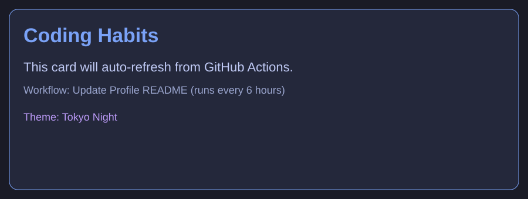
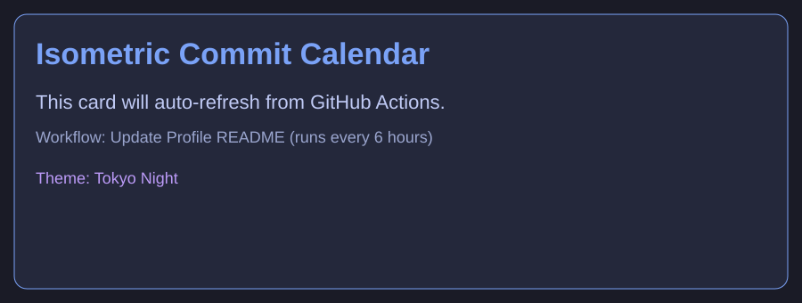
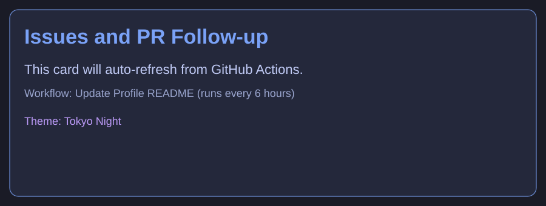
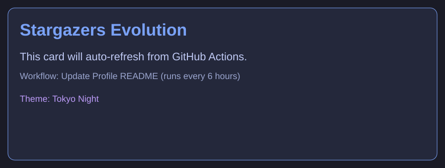
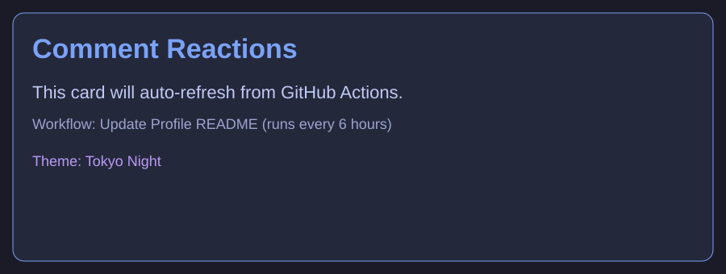
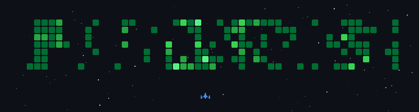

  

  

  
  
  

  <i><strong style="color: #bb9af7;">Crafting code that's clean, fast, and secure — one commit at a time.</strong></i>

  

  

---

<table align="center" style="border: none; background-color: transparent;">
  <tr>
    <td width="50%" valign="top">
      <h3 align="left">⚡ About Me</h3>
      <ul align="left">
        <li>🎓 Computer Science undergrad obsessed with <b>systems programming</b> and <b>secure code</b>.</li>
        <li>💻 Building <b>CLI tools</b>, <b>automation scripts</b>, and <b>privacy-first software</b>.</li>
        <li>🧠 Exploring <b>compilers</b>, <b>language internals</b>, and <b>low-level systems</b>.</li>
        <li>🐧 <b>Arch Linux + Hyprland</b> enthusiast — tweaking my setup is my cardio!</li>
      </ul>
    </td>
    <td width="50%" valign="top" align="center">
      <h3 align="center">🛠️ Tech Stack</h3>
      

        
      

    </td>
  </tr>
</table>

---

<h2 align="center">📊 GitHub Stats (Metrics)</h2>

  <i>Auto-generated every 6 hours via GitHub Actions.</i>

  

 

  
  

 

  
  

 

  
  

 

  

---

<h2 align="center">🎬 Animated Zone</h2>

  
  

 

  

  

