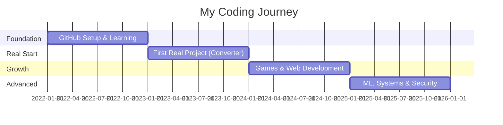

# 📚 My Projects Portfolio

*A comprehensive collection of all projects I've worked on, organized by category and technology.*

  

---

## 🌟 Featured Projects

### 🔐 [CipherPop](https://github.com/OminduD/CipherPop)

**A Cross-platform Programmable Encryption Decryption Tool**

   

**🎯 Key Features:**
- ✨ Cross-platform compatibility (Windows, Linux, macOS)
- 🔒 Multiple encryption algorithms support
- 📝 Programmable encryption/decryption workflows
- 🛡️ Secure key management

**📊 Project Stats:**
- **Topics:** `cryptography` `encryption` `decryption` `cipher` `crypto-tools` `python`
- **Status:** 🟢 Active
- **Created:** 
- **Last Updated:** 
- **License:** MIT

**💻 Tech Stack:** Python, Cryptography Libraries

Cross-platform tool for programmable encryption and decryption operations. Built with security and flexibility in mind, perfect for developers who need reliable encryption utilities.

---

### 🛠 [arch-sandbox](https://github.com/OminduD/arch-sandbox)

**Containerized Arch Linux environment for safe testing**

   

**🎯 Key Features:**
- 🐳 Docker-based containerization
- 🔒 Isolated testing environment
- ⚡ Quick setup and teardown
- 🔧 Perfect for package testing

**📊 Project Stats:**
- **Status:** 🟢 Active
- **Last Updated:** October 2025
- **License:** MIT

**💻 Tech Stack:** Go, Docker, Shell Scripts

A sandboxed Arch Linux environment perfect for testing configurations, packages, and scripts without risking your main system. Built with Go for performance and reliability.

---

### 🧠 [student_stress_ML](https://github.com/OminduD/student_streess_ML)

**Machine learning model for predicting student stress levels**

  

**🎯 Key Features:**
- 📊 Comprehensive data analysis
- 🤖 Multiple ML algorithms implementation
- 📈 Visualization of stress patterns
- 🎯 Predictive modeling

**📊 Project Stats:**
- **Status:** 🟢 Active
- **Last Updated:** October 2025
- **License:** MIT

**💻 Tech Stack:** Python, Jupyter Notebook, Pandas, NumPy, Scikit-learn, Matplotlib

Machine learning project focused on analyzing and predicting student stress levels using various ML algorithms and data analysis techniques. Includes data visualization and comprehensive model evaluation.

---

### 🔄 [Converter](https://github.com/OminduD/Converter) 🎉 **First Real Project!**

**Multi-purpose file and data converter utility**

  

**🎯 Key Features:**
- 🔄 Multiple format conversions
- ⚡ Fast processing
- 🎨 Easy-to-use interface
- 📦 Lightweight and portable

**📊 Project Stats:**
- **Status:** 🟢 Active
- **Created:**  **(My actual first real project! 🚀)**
- **Last Updated:** 

**💻 Tech Stack:** Python

Versatile converter tool for transforming various file formats and data types with ease. Designed for simplicity and efficiency. **This is where my real coding journey began!**

---

## 🎮 Game Development

### 🎯 [monkey_zone](https://github.com/OminduD/monkey_zone)

**Interactive game project**

  

**🎯 Key Features:**
- 🎮 Interactive gameplay mechanics
- 🎨 Custom graphics and animations
- 🎵 Sound effects integration
- 🏆 Score tracking system

**📊 Project Stats:**
- **Status:** 🟢 Active
- **Created:** 
- **Last Updated:** 
- **License:** Unlicense

**💻 Tech Stack:** Python, Pygame

An interactive game built with Python, showcasing game development concepts and mechanics. Features engaging gameplay and smooth animations.

---

### 🏃 [MazeRunner](https://github.com/OminduD/MazeRunner) *(Private)*

**Maze solving game/algorithm**

 

**🎯 Key Features:**
- 🧩 Maze generation algorithms
- 🔍 Pathfinding implementation
- ⚡ Optimized C performance
- 🎮 Interactive solving

**📊 Project Stats:**
- **Status:** 🟢 Active
- **Created:** September 2025
- **Last Updated:** September 2025

**💻 Tech Stack:** C, Algorithms, Data Structures

Low-level implementation of maze generation and solving algorithms in C. Demonstrates efficient memory management and algorithm optimization.

---

## 🌐 Web & Browser Extensions

### ⚡ [Ionex-Tab](https://github.com/OminduD/Ionex-Tab) *(Private)*

**Browser tab extension**

  

**🎯 Key Features:**
- ⚡ Fast tab management
- 🎨 Modern UI/UX design
- 🔧 Customizable settings
- 🌐 Cross-browser compatible

**📊 Project Stats:**
- **Status:** 🟢 Active
- **Created:** October 2025
- **Last Updated:** October 2025
- **License:** GPL-3.0

**💻 Tech Stack:** TypeScript, Web Extensions API, HTML/CSS

Modern browser extension built with TypeScript for enhanced tab management and productivity. Features a clean interface and powerful customization options.

---

### 🌍 [MyFirstProject](https://github.com/OminduD/MyFirstProject) *(Private)*

**Initial web development project**

 

**📚 Learning Topics:**
- 🎯 HTML fundamentals
- 🎨 Basic styling with CSS
- 🌐 Web page structure
- 💡 Foundation building

**📊 Project Stats:**
- **Status:** 📦 Archive
- **Created:** June 2025
- **Last Updated:** June 2025

**💻 Tech Stack:** HTML, CSS

My first foray into web development, learning the fundamentals of HTML and CSS. A milestone in my coding journey!

---

## 🤖 AI & Machine Learning

### 📊 [Risk](https://github.com/OminduD/Risk) *(Private)*

**Risk analysis project**

**🎯 Key Features:**
- 📊 Statistical analysis
- 📈 Risk modeling
- 🔍 Data exploration
- 📉 Predictive insights

**📊 Project Stats:**
- **Status:** 🟢 Active
- **Created:** October 2025
- **Last Updated:** October 2025

**💻 Tech Stack:** Python, Jupyter Notebook, NumPy, Pandas

Data analysis and risk assessment project using machine learning techniques. Focused on identifying patterns and predicting potential risks.

---

### 💬 [chatbotbasic](https://github.com/OminduD/chatbotbasic) *(Private)*

**Basic chatbot implementation**

 

**🎯 Key Features:**
- 💬 Natural language processing
- 🤖 Pattern recognition
- 🗨️ Response generation
- 📚 Learning algorithms

**📊 Project Stats:**
- **Status:** 📦 Archive
- **Created:** February 2024
- **Last Updated:** February 2024

**💻 Tech Stack:** Python, NLTK

Foundational chatbot project exploring natural language processing and conversation flows. A stepping stone into AI development.

---

## 🛠 Utilities & Tools

### 📁 [folderloop](https://github.com/OminduD/folderloop) *(Private)*

**Folder traversal utility**

**🎯 Key Features:**
- 📂 Recursive folder scanning
- ⚡ Fast file processing
- 🔍 Pattern matching
- 📊 Directory analysis

**📊 Project Stats:**
- **Status:** 🟢 Active
- **Created:** June 2023
- **Last Updated:** February 2025

**💻 Tech Stack:** Python, OS Libraries

Tool for efficiently traversing and processing folder structures. Perfect for batch operations and file management tasks.

---

### 🌐 [request](https://github.com/OminduD/request) *(Private)*

**HTTP request utility**

 

**🎯 Key Features:**
- 🌐 HTTP request handling
- 🔄 Response processing
- 📝 Custom headers support
- ⚙️ Error handling

**📊 Project Stats:**
- **Status:** 📦 Archive
- **Created:** June 2023
- **Last Updated:** June 2023

**💻 Tech Stack:** Python, Requests Library

Custom HTTP request handler for various web interactions. Built to understand networking concepts and API communication.

---

## 💬 Communication Tools

### 💬 [DiscordMsg](https://github.com/OminduD/DiscordMsg) *(Private)*

**Discord messaging utility**

 

**🎯 Key Features:**
- 💬 Automated messaging
- 🤖 Bot interactions
- 📨 Message scheduling
- 🔧 Custom commands

**📊 Project Stats:**
- **Status:** 📦 Archive
- **Created:** February 2025
- **Last Updated:** February 2025

**💻 Tech Stack:** C#, Discord.NET, .NET Framework

Automation tool for Discord messaging and interactions. Built with C# to explore Discord API capabilities.

---

## 🔬 Data Science & Analysis

### 📊 [SSR](https://github.com/OminduD/SSR) *(Private)*

**Statistical analysis project**

 

**🎯 Key Features:**
- 📊 Statistical modeling
- 📈 Data visualization
- 🔍 Pattern analysis
- 📉 Reporting tools

**📊 Project Stats:**
- **Status:** 🔨 In Development
- **Last Updated:** October 2025

**💻 Tech Stack:** Python, Statistical Libraries

Statistical analysis and reporting project focused on data-driven insights and comprehensive reporting.

---

## 🎓 Learning & Tutorials

### 📖 [desktop-tutorial](https://github.com/OminduD/desktop-tutorial) *(Private)*

**GitHub Desktop auto-generated tutorial repository**

 

**📚 Learning Topics:**
- 🎯 GitHub Desktop basics
- 🔀 Version control fundamentals
- 📝 Commit best practices
- 🌿 Branch management

**📊 Project Stats:**
- **Status:** 📦 Archive
- **Created:** April 2022 (Auto-generated by GitHub Desktop)
- **Last Updated:** April 2022

Auto-generated tutorial repository created by GitHub Desktop for learning version control basics.

---

### 🧪 [TPVerification](https://github.com/OminduD/TPVerification) *(Private)*

**Verification system**

 

**🎯 Key Features:**
- ✅ Data verification
- 🔐 Security checks
- 📊 Validation logic
- 🛠️ Custom rules

**📊 Project Stats:**
- **Status:** 📦 Archive
- **Created:** February 2024
- **Last Updated:** February 2024

**💻 Tech Stack:** JavaScript, Node.js

JavaScript-based verification system project exploring validation logic and security practices.

---

## 📱 Profile & Documentation

### 👤 [OminduD](https://github.com/OminduD/OminduD)

**GitHub Profile README**

 

**🎯 Features:**
- 📊 Live GitHub stats
- 🏆 Achievement trophies
- 📈 Contribution graphs
- 🎨 Animated elements
- 🔗 Social links

**📊 Project Stats:**
- **Status:** 🟢 Active & Maintained
- **Created:** 
- **Last Updated:** 

**💻 Tech Stack:** Markdown, GitHub Actions, SVG

My GitHub profile repository showcasing my work, stats, and interests. Features dynamic content and automated updates.

---

### 🚀 [my-first-repo](https://github.com/OminduD/my-first-repo)

**Learning milestone repository**

 

**💭 Significance:**
- 📚 Learning repository
- 🌱 Growth milestone
- 💫 Part of my journey

**📊 Project Stats:**
- **Status:** 📦 Archive (Preserved)
- **Created:** June 2025

A repository created during my learning journey. *Note: My actual first real project was **Converter** (June 2023), which started my real development journey!*

---

## 📊 Project Statistics

### 📈 Overview

| Category | Count | Percentage |
|----------|-------|------------|
| **Total Repositories** |  | 100% |
| **Public Projects** |  | ~39% |
| **Private Projects** |  | ~61% |
| **Active Projects** |  | 55%+ |
| **Archived Projects** |  | 33% |

### 🗂️ By Category

| Category | Projects | Key Technologies |
|----------|----------|------------------|
| 🔐 **Security & Crypto** | 1 |  |
| 🤖 **AI & ML** | 3 |   |
| 🎮 **Game Dev** | 2 |   |
| 🌐 **Web & Extensions** | 2 |   |
| 🛠️ **Utilities** | 4 |   |
| 💬 **Communication** | 1 |  |
| 🎓 **Learning** | 3 |  |
| 📱 **Profile & Docs** | 2 |  |

### 💻 Programming Languages Used

  

| Language | Projects | Primary Use |
|----------|----------|-------------|
|  | 10+ | ML, Automation, Tools |
|  | 1+ | Web Development |
|  | 1+ | Browser Extensions |
|  | 1+ | Systems Programming |
|  | 1+ | Algorithms, Systems |
|  | 1+ | Automation Tools |
|  | 1+ | Web Development |
|  | 3+ | Data Science, ML |

---

## 🏆 Featured Technologies

  

---

## 📈 Project Timeline

### 🚀 Evolution Path

| Year | Focus Areas | Key Projects |
|------|-------------|-------------|
| **2022** 🌱 | Git & Version Control | `desktop-tutorial` (GitHub tutorial) |
| **2023** � | Python Fundamentals | **`Converter` (First Real Project!)**, `folderloop`, `request` |
| **2024** 🎮 | Games & Web Dev | `monkey_zone`, `chatbotbasic`, `TPVerification` |
| **2025** � | ML, Systems, Crypto | `CipherPop`, `arch-sandbox`, `student_stress_ML`, `Ionex-Tab` |

---

## 🎯 Areas of Focus

| Focus Area | Technologies | Projects |
|------------|-------------|----------|
| 🔐 **Security & Cryptography** |   | CipherPop |
| 🤖 **Machine Learning** |    | student_stress_ML, Risk |
| 🎮 **Game Development** |   | monkey_zone, MazeRunner |
| 🐧 **Systems Programming** |    | arch-sandbox |
| 🌐 **Web Development** |    | Ionex-Tab, MyFirstProject |
| 🛠 **DevOps & Tools** |   | arch-sandbox, folderloop |

### 🌟 Current Focus (2025)

  

---

## 📫 Get Involved

Interested in collaborating on any of these projects? Feel free to:

- ⭐ Star the repositories you find interesting
- 🍴 Fork and contribute
- 🐛 Report issues or suggest features
- 💬 Reach out via [LinkedIn](https://linkedin.com/in/omindud) or [Twitter](https://twitter.com/OminduD)

---

  <i>"Every project is a learning opportunity. Every line of code is a step forward."</i>
  
    
  
  [🏠 Back to Main Profile](../README.md) • [📚 What I'm Learning](./LEARNING.md)

